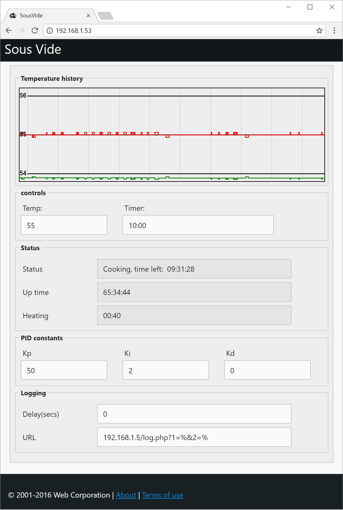

# ESP8266 Sous Vide Controller

Sous-vide (/suːˈviːd/; French for "under vacuum") is a method of cooking in which food is vacuum-sealed in a plastic pouch and then placed in a water bath or steam environment for longer than normal cooking times (usually 1 to 7 hours, up to 48 or more in some cases) at an accurately regulated temperature much lower than normally used for cooking (typically around 55 to 60 °C (131 to 140 °F) for meat, higher for vegetables). The intent is to cook the item evenly, ensuring that the inside is properly cooked without overcooking the outside, and to retain moisture. 

## Quick Start

You'll need the following hardware:

1) a relay capable to turn on and off a heater element
2) A 1-Wire DS18B20 temperature sensors

On the software side you will need to modify the config.h file to fit your needs.

Compile, upload and connect to it using a browser, and the UI should be self explanatory (or so I hope)

